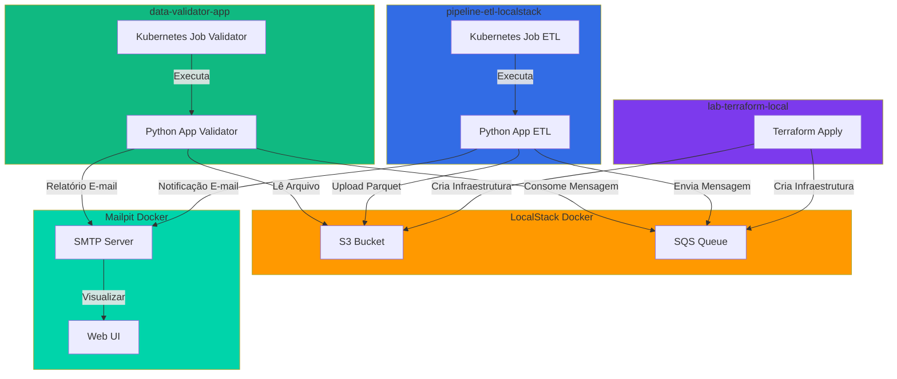

# Pipeline ETL LocalStack - Projeto Cloud Brasil

Pipeline ETL completo executando localmente sem custos, utilizando LocalStack (Docker) para simular serviços AWS, Mailpit para e-mails, Kubernetes para orquestração de jobs e Terraform para infraestrutura como código.

## 📋 Visão Geral

Este projeto implementa a parte de processamento de um pipeline de ETL (Extract, Transform, Load) totalmente local, permitindo desenvolvimento e testes sem custos de infraestrutura na nuvem. Este projeto é responsável por processar dados, convertê-los para formato Parquet, fazer upload para S3 e notificar via SQS. A validação dos dados e geração de relatórios é feita pelo projeto **data-validator-app**.

### Características Principais

- ✅ **100% Local**: Nenhuma conexão externa, zero custos
- ✅ **Infraestrutura como Código**: Terraform para provisionamento automático
- ✅ **Orquestração**: Kubernetes Jobs para execução agendada
- ✅ **Monitoramento**: E-mails de notificação via Mailpit
- ✅ **Simulação AWS**: LocalStack para S3 e SQS locais

## 🏗️ Arquitetura



## 🔄 Fluxo de Dados

1. **Infraestrutura**: Terraform (lab-terraform-local) cria bucket S3 e fila SQS no LocalStack
2. **Ingestão** (pipeline-etl-localstack): Dados são gerados e convertidos para formato Parquet
3. **Upload** (pipeline-etl-localstack): Arquivo Parquet é enviado para o S3 (LocalStack)
4. **Notificação** (pipeline-etl-localstack): Mensagem é enviada para a fila SQS com metadados do arquivo e e-mail de notificação
5. **Consumo** (data-validator-app): Aplicação consome a mensagem da fila SQS
6. **Validação** (data-validator-app): Dados são lidos do S3, validados e estatísticas são calculadas
7. **Relatório** (data-validator-app): E-mail com relatório de qualidade é enviado via Mailpit
8. **Limpeza** (data-validator-app): Mensagem processada é removida da fila

## 🛠️ Tecnologias

- **Python 3.12**: Linguagem principal
- **boto3**: Cliente AWS para S3 e SQS
- **pandas**: Processamento e análise de dados
- **pyarrow**: Leitura/escrita de arquivos Parquet
- **LocalStack**: Emulação de serviços AWS localmente
- **Mailpit**: Servidor SMTP local para testes de e-mail
- **Kubernetes**: Orquestração de containers e jobs
- **Terraform**: Provisionamento de infraestrutura
- **Docker**: Containerização da aplicação

## 📁 Estrutura do Projeto

```
pipeline-etl-localstack/
├── app.py              # Aplicação principal com lógica ETL
├── Dockerfile          # Imagem Docker da aplicação
├── job.yaml            # Manifesto Kubernetes Job
├── requirements.txt    # Dependências Python
└── README.md           # Documentação do projeto
```

## 🔗 Projetos Relacionados

Este projeto faz parte de um ecossistema de três projetos que trabalham juntos:

### 1. lab-terraform-local - Infraestrutura como Código
**Repositório**: [lab-terraform-local](https://github.com/victorftrdba/lab-terraform-local)

Responsável por criar e gerenciar a infraestrutura local usando Terraform:
- Criação do bucket S3 no LocalStack
- Criação da fila SQS no LocalStack
- Configuração de políticas e permissões
- Provisionamento automatizado com `terraform apply`

**Ordem de execução**: Este projeto deve ser executado **primeiro** para criar a infraestrutura necessária.

### 2. pipeline-etl-localstack - Pipeline de Processamento (Este Projeto)
**Repositório**: [pipeline-etl-localstack](https://github.com/victorftrdba/pipeline-etl-localstack)

Aplicação Python responsável pelo processamento inicial dos dados:
- Geração/processamento de dados
- Conversão para formato Parquet
- Upload do arquivo Parquet para S3
- Criação de mensagem na fila SQS com metadados do arquivo
- Envio de e-mail de notificação via Mailpit

**Ordem de execução**: Este projeto é executado **após** a infraestrutura estar pronta e **antes** do validador.

### 3. data-validator-app - Validação e Relatórios
**Repositório**: [data-validator-app](https://github.com/victorftrdba/data-validator-app)

Aplicação Python responsável pela validação dos dados processados:
- Consumo de mensagens da fila SQS
- Leitura do arquivo Parquet do S3
- Validação de dados e cálculo de estatísticas
- Geração e envio de relatório de qualidade por e-mail via Mailpit
- Remoção da mensagem processada da fila

**Ordem de execução**: Este projeto é executado **após** o pipeline-etl-localstack criar as mensagens na fila.

## 📦 Pré-requisitos

Antes de começar, certifique-se de ter instalado:

- **Docker** (versão 20.10 ou superior)
- **Docker Compose** (versão 2.0 ou superior)
- **Kubernetes** (kubectl configurado)
- **Terraform** (versão 1.0 ou superior)
- **Python 3.12** (para desenvolvimento local)
- **AWS CLI** (opcional, para testes manuais)

## 🚀 Instalação e Configuração

### 1. Clone os Repositórios

```bash
# Clone este repositório
git clone https://github.com/victorftrdba/pipeline-etl-localstack.git
cd pipeline-etl-localstack

# Clone os projetos relacionados
git clone https://github.com/victorftrdba/lab-terraform-local.git
git clone https://github.com/victorftrdba/data-validator-app.git
```

### 2. Inicie LocalStack e Mailpit

Certifique-se de que o LocalStack e Mailpit estão rodando. Você pode usar Docker Compose ou iniciá-los manualmente:

```bash
# Inicie LocalStack
docker run -d --name localstack \
  -p 4566:4566 \
  -e SERVICES=s3,sqs \
  localstack/localstack

# Inicie Mailpit
docker run -d --name mailpit \
  -p 8025:8025 \
  -p 1025:1025 \
  axllent/mailpit

# Verifique se os serviços estão rodando
docker ps
```

### 3. Configure a Infraestrutura

```bash
# Navegue até o projeto Terraform
cd ../lab-terraform-local

# Inicialize o Terraform
terraform init

# Aplique a infraestrutura (cria S3 e SQS no LocalStack)
terraform apply
```

### 4. Configure o Data Validator (Opcional)

Se você quiser testar o fluxo completo, configure também o data-validator-app:

```bash
# Navegue até o projeto validador
cd ../data-validator-app

# Siga as instruções do README do projeto para configurá-lo
```

### 5. Configure Variáveis de Ambiente

Crie um arquivo `.env` (opcional) ou configure as variáveis de ambiente:

```bash
export AWS_ENDPOINT_URL="http://localhost:4566"
export S3_BUCKET_NAME="projeto-cloud-brasil-bucket"
export SQS_QUEUE_NAME="projeto-cloud-brasil-queue"
export AWS_DEFAULT_REGION="us-east-1"
export AWS_ACCESS_KEY_ID="test"
export AWS_SECRET_ACCESS_KEY="test"
```

### 6. Construa a Imagem Docker

```bash
# Volte para o projeto do pipeline
cd ../pipeline-etl-localstack

# Construa a imagem Docker
docker build -t data-pipeline-local:v1 .
```

### 7. Configure o Kubernetes

```bash
# Crie o namespace (se não existir)
kubectl create namespace data-science-env

# Aplique o Job
kubectl apply -f job.yaml
```

## 💻 Uso

### Executar o Pipeline via Kubernetes

```bash
# Execute o job
kubectl apply -f job.yaml

# Verifique o status do job
kubectl get jobs -n data-science-env

# Visualize os logs
kubectl logs -n data-science-env job/data-pipeline-job

# Execute novamente (deletar e recriar)
kubectl delete -f job.yaml && kubectl apply -f job.yaml
```

### Executar Localmente (Desenvolvimento)

```bash
# Instale as dependências
pip install -r requirements.txt

# Execute a aplicação
python app.py
```

### Executar com Docker

```bash
# Execute o container
docker run --rm \
  -e AWS_ENDPOINT_URL=http://host.docker.internal:4566 \
  -e AWS_ACCESS_KEY_ID=test \
  -e AWS_SECRET_ACCESS_KEY=test \
  -e AWS_DEFAULT_REGION=us-east-1 \
  data-pipeline-local:v1
```

## 📊 Monitoramento

### Visualizar E-mails no Mailpit

Acesse a interface web do Mailpit para visualizar os e-mails enviados:

```
http://localhost:8025
```

Você verá diferentes tipos de e-mails dependendo do projeto:

**E-mails do pipeline-etl-localstack:**
- **Notificação de Processamento**: Enviado quando o arquivo Parquet é criado e enviado para S3

**E-mails do data-validator-app:**
- **Relatório de Qualidade de Dados**: Enviado quando um arquivo é validado com sucesso
  - Total de linhas processadas
  - Valor total e média
  - Status do schema
- **Fila Vazia**: Enviado quando não há mensagens na fila SQS
- **Erro no Processamento**: Enviado quando ocorre algum erro durante a validação

### Verificar Logs

```bash
# Logs do Kubernetes
kubectl logs -n data-science-env -l job-name=data-pipeline-job

# Logs do LocalStack
docker logs localstack

# Logs do Mailpit
docker logs mailpit
```

### Verificar Recursos AWS Locais

```bash
# Listar buckets S3
aws --endpoint-url=http://localhost:4566 s3 ls

# Listar filas SQS
aws --endpoint-url=http://localhost:4566 sqs list-queues

# Ver mensagens na fila
aws --endpoint-url=http://localhost:4566 sqs receive-message \
  --queue-url http://localhost:4566/000000000000/projeto-cloud-brasil-queue
```

## 🔧 Configuração Avançada

### Variáveis de Ambiente do Job Kubernetes

Edite o arquivo `job.yaml` para ajustar as configurações:

```yaml
env:
- name: AWS_ENDPOINT_URL
  value: "http://host.docker.internal:4566"
- name: S3_BUCKET_NAME
  value: "projeto-cloud-brasil-bucket"
- name: SQS_QUEUE_NAME
  value: "projeto-cloud-brasil-queue"
```

### Configuração de E-mail

Edite as constantes no `app.py`:

```python
SMTP_SERVER = "localhost"
SMTP_PORT = 1025
EMAIL_FROM = "analista@cloudbrasil.com.br"
EMAIL_TO = "seu-email@exemplo.com"
```

## 🧪 Testes

### Testar o Pipeline Completo

1. Certifique-se de que LocalStack e Mailpit estão rodando
2. Execute o Terraform (lab-terraform-local) para criar a infraestrutura
3. Execute o pipeline-etl-localstack (este projeto) via Kubernetes ou localmente
4. Execute o data-validator-app para consumir as mensagens e validar os dados
5. Verifique os e-mails no Mailpit (http://localhost:8025)
6. Verifique os logs para confirmar o processamento

### Testar Componentes Individualmente

```bash
# Testar conexão com S3
aws --endpoint-url=http://localhost:4566 s3 ls s3://projeto-cloud-brasil-bucket/

# Testar conexão com SQS
aws --endpoint-url=http://localhost:4566 sqs get-queue-url \
  --queue-name projeto-cloud-brasil-queue

# Testar envio de e-mail
python -c "import smtplib; s = smtplib.SMTP('localhost', 1025); s.quit()"
```

## 🐛 Troubleshooting

### Problema: Job não consegue conectar ao LocalStack

**Solução**: Verifique se o `AWS_ENDPOINT_URL` está correto. No Kubernetes, use `http://host.docker.internal:4566` para acessar serviços do host.

### Problema: E-mails não aparecem no Mailpit

**Solução**: 
- Verifique se o Mailpit está rodando: `docker ps | grep mailpit`
- Verifique a porta SMTP (padrão: 1025)
- Verifique os logs: `docker logs mailpit`

### Problema: Erro ao criar recursos no LocalStack

**Solução**: 
- Verifique se o LocalStack está rodando: `docker ps | grep localstack`
- Verifique os logs: `docker logs localstack`
- Certifique-se de que o Terraform está usando o endpoint correto

## 📝 Licença

Este projeto é parte do ecossistema Cloud Brasil e está disponível para fins educacionais e de desenvolvimento.

## 👥 Contribuindo

Contribuições são bem-vindas! Por favor:

1. Faça um fork do projeto
2. Crie uma branch para sua feature (`git checkout -b feature/AmazingFeature`)
3. Commit suas mudanças (`git commit -m 'Add some AmazingFeature'`)
4. Push para a branch (`git push origin feature/AmazingFeature`)
5. Abra um Pull Request

## 📧 Contato

Para dúvidas ou sugestões, abra uma issue no repositório.

---

**Desenvolvido com ❤️ para aprendizado e desenvolvimento local sem custos**

